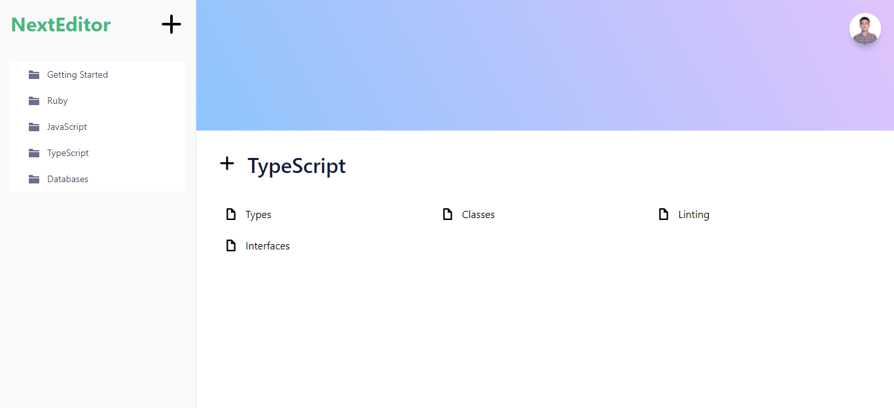

# NextEditor

- This is a Document editing app that helps you to organise and edit your documents in one place without any difficulties. In order to use the app, you should only sign up with your Github profile.

### Dashboard

## Main Features

- A proper authentication system has been implemented using JWT with NextAuth.
- User can create folders for his documents.
- User can create documents inside the folders.
- User can write and edit the documents. Editor js will save documents automatically.
- Blog posts are in mdx file.Reading them as a component with Next js. You can see blogs in blogs page.

## Built with

- Next js
- TypeScript
- Node
- Editor js
- Evergreen Ui

## Getting Started

- Clone the repo `git@github.com:Murodjon000/next-editor.git`
- cd `into` the project
- Run `git pull origin app`
- Run `yarn install` or `npm install` to install dependencies
- On the terminal run `yarn dev` open up the live server
- To run tests write `yarn test` or `npm run test` on the terminal

## Author

👤 **Murodjon Tursunpulatov**

- Github: [@murodjon000](https://github.com/murodjon000)
- Twitter: [@MurodjonTursun5](https://twitter.com/MurodjonTursun5)
- Linkedin: [@Murodjon Tursunpulatov](https://www.linkedin.com/in/murodjon-tursunpulatov-5189481b3/)

## 🤝 Contributing

Contributions, issues and feature requests are welcome!

Feel free to check the [issues page](issues/).

## Show your support

Give a ⭐️ if you like this project!
